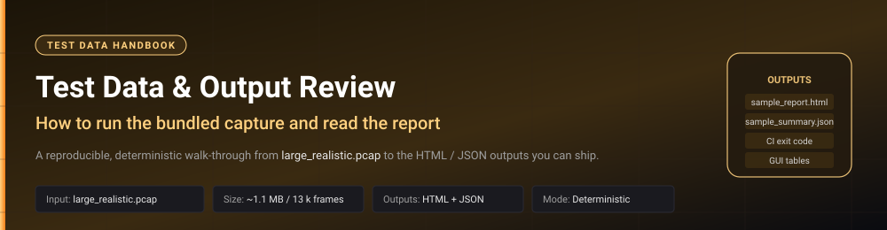
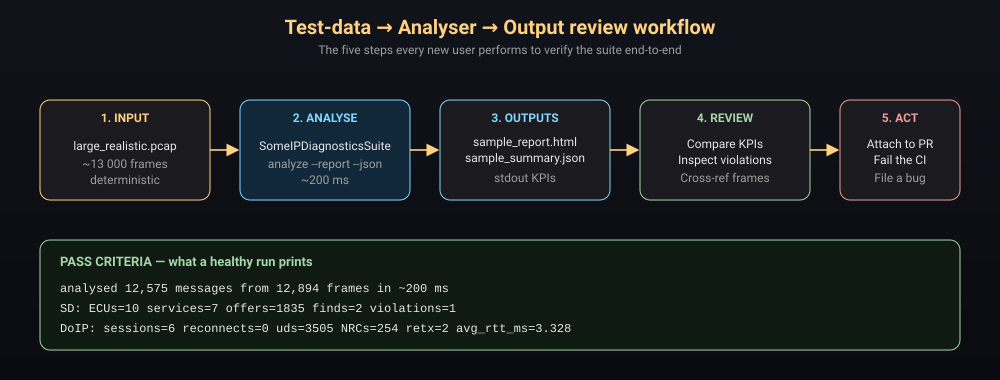

<!--
  Test Data & Output Review — Handbook
  ====================================
  A professional, illustrated walk-through for somebody who wants to use
  the bundled test data with SomeIPDiagnosticsSuite.exe and review what
  comes out.
-->



<div align="center">

**Document:** Test Data &amp; Output Review &nbsp;·&nbsp; **Product:** `SomeIPDiagnosticsSuite.exe` &nbsp;·&nbsp; **Version:** v2
**Companion to:** [`TOOL_GUIDE.md`](TOOL_GUIDE.md)
**Inputs:** `testdata/large_realistic.pcap` &nbsp;·&nbsp; **Outputs:** `sample_report.html`, `sample_summary.json`

</div>

---

## Executive summary

This handbook is the *practical* counterpart to the
[Tool Guide](TOOL_GUIDE.md). It assumes the executable is already on
your machine and walks you through the **five-step workflow** every new
user follows to verify the suite end-to-end:

> **Input → Analyse → Outputs → Review → Act**

The repository ships a **deterministic, realistically large** capture
(`testdata/large_realistic.pcap`, ~ 13 000 frames, ~ 1.1 MB) that
exercises every analyser in the suite, plus a pre-generated HTML
report and JSON summary so you know exactly what success looks like
*before* you run anything.

When you finish this document you will be able to:

* Run the bundled test data through the GUI **and** the CLI.
* Compare your output against the bundled "golden" report and JSON.
* Read the HTML report section-by-section and explain every KPI to a
  reviewer.
* Regenerate or inflate the capture for stress and regression tests.
* Wire the same review steps into a CI pipeline.



---

## Table of contents

1. [What is in the test data folder](#1-what-is-in-the-test-data-folder)
2. [What is inside the capture](#2-what-is-inside-the-capture)
3. [Running the capture through the tool](#3-running-the-capture-through-the-tool)
4. [Pass criteria — golden numbers](#4-pass-criteria--golden-numbers)
5. [Reviewing the HTML report](#5-reviewing-the-html-report)
6. [Reviewing the JSON summary](#6-reviewing-the-json-summary)
7. [Cross-referencing frames with Wireshark](#7-cross-referencing-frames-with-wireshark)
8. [Regenerating &amp; inflating the capture](#8-regenerating--inflating-the-capture)
9. [Using the test data in CI](#9-using-the-test-data-in-ci)
10. [Troubleshooting the review](#10-troubleshooting-the-review)

---

## 1. What is in the test data folder

```
testdata/
├── README.md                  # short reference (this document is the long form)
├── generate_test_pcap.py      # deterministic generator (re-creates the pcap)
├── large_realistic.pcap       # the capture (~13 000 frames, ~1.1 MB)
├── sample_report.html         # pre-generated "golden" HTML report
└── sample_summary.json        # pre-generated "golden" JSON summary
```

| File | Size | Role |
|------|------|------|
| `large_realistic.pcap` | ~ 1.1 MB / ≈ 13 000 frames | **Input** to the analyser. libpcap 2.4. |
| `generate_test_pcap.py` | small Python script | **Generator** — re-run to make the pcap larger or smaller. Pure stdlib. |
| `sample_report.html` | ~ 930 KB | **Golden output** — what a healthy run produces. Open this *before* running the tool so you know what to expect. |
| `sample_summary.json` | &lt; 1 KB | **Golden machine-readable output**. Diff your run against it in CI. |

> 💡 **Why ship the capture instead of regenerating it on the fly?**
> Because the analyser must produce **bit-for-bit identical numbers**
> on every machine for the test to be a meaningful regression. The
> capture is therefore committed as a binary asset; the generator is
> committed alongside it so you can audit how it was built.

---

## 2. What is inside the capture

Every byte was produced by the same codecs that ship in
`src/someip_suite/protocols/`, so the pcap round-trips cleanly through
the analyser. The capture deliberately exercises every analyser path —
healthy, faulty *and* noisy.

### 2.1 SOME/IP-SD — Service Discovery

| ECU IP | Service-ID | Behaviour |
|--------|-----------|-----------|
| `10.0.0.10` | `0x1001` | Well-behaved: INITIAL_DELAY 50 ms, REPETITIONS_BASE_DELAY 200 ms (doubled ×4), CYCLIC_OFFER_DELAY 2 000 ms |
| `10.0.0.11` | `0x1002` | Well-behaved (different timing constants) |
| `10.0.0.12` | `0x1010` | Well-behaved |
| `10.0.0.13` | `0x2001` | Well-behaved |
| `10.0.0.14` | `0x2010` | Well-behaved |
| `10.0.0.15` | `0x3000` | Well-behaved |
| **`10.0.0.99`** | **`0x9999`** | **Misbehaving** — repetition phase flat-lines at 200 ms with **no exponential back-off**. AUTOSAR PRS R21-11 §4.2.1 violation. **This is the headline finding.** |
| `10.0.0.50` | — | Head-unit issuing FindService probes for two services |
| `10.0.0.60` / `10.0.0.61` | — | Consumers issuing SubscribeEventgroup |

### 2.2 DoIP — ISO 13400-2 :2019 sessions

Five TCP sessions between the tester `10.0.0.200` and various entities
on port 13400:

| # | Description | What it exercises |
|---|-------------|-------------------|
| 1 | TesterPresent loop — 500 × `0x3E 0x00` | High-rate keep-alives, RTT statistics |
| 2 | ReadDataByIdentifier loop — 3 000 requests, ~ 8 % NRC `0x31` (requestOutOfRange) | Bulk UDS flow, NRC counter |
| 3 | RoutineControl with 3 × NRC `0x78` (response-pending) then positive | Response-pending recognition |
| 4 | RoutingActivation rejected (`UNKNOWN_SA`), tester reconnects with valid SA, then reads VIN | Reconnect handling |
| 5 | ReadDataByIdentifier with no ack on first try, application-level retransmit | Retransmit detection |

### 2.3 Background noise

300 unrelated UDP / TCP frames so the protocol filter is exercised on
traffic it should *ignore*.

---

## 3. Running the capture through the tool

You have three equivalent ways of driving the analyser. Pick the one
that matches your environment.

### 3.1 From the GUI (engineer at a laptop)

1. Double-click `SomeIPDiagnosticsSuite.exe`.
2. **File ▸ Open .pcap / .pcapng…** (or `Ctrl+O`) → select
   `testdata/large_realistic.pcap`.
3. Confirm the status-bar reads
   `Capture loaded: large_realistic.pcap   12,894 frames   12,575 decoded`.

   

4. Switch to the **SD Analyzer** tab → press **▶ Re-analyse** (`F5`).
   The KPI strip should read **ECUs=10, Services=7, Offers=1 835,
   Finds=2, Violations=1**.

   

5. Switch to the **DoIP Analyzer** tab → press **▶ Re-analyse**.
   Six sessions; ~ 254 NRCs; 2 retransmits; one rejected
   RoutingActivation followed by a successful reconnect.

   

6. **File ▸ Save HTML report…** → write to a path of your choice and
   compare against `testdata/sample_report.html`.

### 3.2 From the CLI (one-line smoke test)

```bat
SomeIPDiagnosticsSuite.exe analyze testdata\large_realistic.pcap ^
    --report report.html ^
    --json   summary.json
```


### 3.3 From source (developers)

```bash
PYTHONPATH=src python -m someip_suite analyze \
    testdata/large_realistic.pcap \
    --report testdata/sample_report.html \
    --json   testdata/sample_summary.json
```

All three paths produce the **same numbers** — that is the point of a
deterministic capture.

---

## 4. Pass criteria — golden numbers

A run is correct when stdout matches:

```text
analysed 12,575 messages from 12,894 frames in ~200 ms
  SD:   ECUs=10  services=7  offers=1835  finds=2  violations=1
  DoIP: sessions=6  reconnects=0  uds=3505  NRCs=254  retx=2  avg_rtt_ms=3.328
```

…and the JSON summary matches:

```json
{
  "sd":   { "ecus": 10, "services": 7, "offers": 1835, "violations": 1 },
  "doip": { "sessions": 6, "uds_exchanges": 3505,
            "negative_responses": 254, "retransmits": 2 }
}
```

Any deviation is significant — it means either the capture has been
modified, the generator has been re-run with different parameters, or
the analyser has regressed. Investigate before you ship.

> ✅ **Smoke-test rule of thumb**
> *Violations = 1, NRCs ≈ 254, RTT ≈ 3.3 ms ⇒ healthy build.*
> *Anything else ⇒ stop and read §10 Troubleshooting.*

---

## 5. Reviewing the HTML report

`sample_report.html` (and any report you generate) is a single
self-contained file laid out top-to-bottom. Use the schematic below as
a map.


### 5.1 Capture summary

The first section is a three-tile strip:

* **Messages** — total decoded SOME/IP + SOME/IP-SD + DoIP messages.
* **doip** — DoIP message count.
* **someip-sd** — SOME/IP-SD message count.

**Use it for:** a sanity check that the decoder saw what you expected.
If `doip` is zero on a pcap that should contain DoIP, you almost
certainly opened the wrong file or your port-13400 traffic is on a
non-standard port.

### 5.2 SOME/IP-SD timing

A KPI strip of five tiles:

| KPI | Meaning |
|-----|---------|
| **ECUs** | Unique source IPs that sent at least one SD message. |
| **Services** | Distinct service-IDs advertised. |
| **OfferService** | Total `OfferService` entries. |
| **FindService** | Total `FindService` probes. |
| **Violation** | **The headline finding.** Non-zero means the SD analyser detected at least one AUTOSAR PRS R21-11 timing breach. **Always start your review here.** |

### 5.3 Per-ECU × service timing

A table with one row per (ECU, service) pair carrying the recovered
`INITIAL_DELAY`, `REPETITIONS_BASE_DELAY` and `CYCLIC_OFFER_DELAY`
in milliseconds. Compare against the AUTOSAR window you expect for
your project — values outside the window are tagged in the next
section.

### 5.4 SD violations  *(only present when violations exist)*

The single most important table in the report. Columns:

| Column | What to do with it |
|--------|--------------------|
| `kind` | The class of violation (e.g. `missing-exponential-backoff`, `initial-delay-out-of-window`, `cyclic-offer-drift`). |
| `ecu` / `service_id` | Tells you **which ECU and service** to talk to. |
| `frame_index` | The exact 1-based frame number in the pcap — paste it into Wireshark's "Go to packet" dialog to see the raw bytes. |
| `detail` | Human-readable explanation of *why* the rule fired. |

On the bundled capture you should see exactly one row:

> `missing-exponential-backoff  ecu=10.0.0.99  service=0x9999  frame=…  detail=repetition phase did not double the base delay`

### 5.5 DoIP sessions

KPI strip then a table with one row per TCP session:

* **client → entity** (source-IP : port → dest-IP : 13400)
* **RoutingActivation outcome** (accepted / rejected reason)
* **RA latency** (ms)
* **AliveCheck pairing** (matched / orphaned)
* **UDS messages** (count)
* **NRCs** (count; red when &gt; 0)
* **Retransmits** (count; yellow when &gt; 0)
* **Average RTT** (ms)

### 5.6 Per-session UDS detail

Click / scroll to each session block. One row per request → response
pair carries the **SID**, **RTT**, **ack present**, **NRC byte**,
**retransmit counter**, and the **hex of the request and response
payload**. Rows are colour-coded:

| Colour | Meaning |
|--------|---------|
| neutral | Positive response |
| **red** | Negative response (NRC) |
| **yellow** | Retransmit detected |

### 5.7 Review checklist

Use this as a stand-alone reviewer's worksheet:

- [ ] **Capture summary** — message counts roughly match the source pcap size.
- [ ] **SD KPI strip** — `Violation` count matches expectation (1 for the bundled capture).
- [ ] **SD violations** — every row has been triaged to a bug ID or marked as expected.
- [ ] **Per-ECU timing** — no `INITIAL_DELAY` outside your project's window.
- [ ] **DoIP sessions** — every session has a green RoutingActivation outcome (or the failure is expected).
- [ ] **NRCs** — distribution makes sense (the bundled capture intentionally has ~ 8 % NRC `0x31`).
- [ ] **Retransmits** — count is &lt; threshold for your project.
- [ ] **Average RTT** — within your bus's nominal range.

---

## 6. Reviewing the JSON summary

`sample_summary.json` is the machine-readable twin of the HTML report.
It is intentionally flat and tiny (under 1 KB on the bundled capture)
so you can:

* `diff` it against the previous run for regression testing,
* feed it into a Grafana / Splunk / Excel dashboard,
* assert on individual values in pytest / NUnit,
* pin it as a "golden" file in your repo and re-generate on every PR.

Top-level keys you can rely on:

| Key | Type | Notes |
|-----|------|-------|
| `sd.ecus` / `sd.services` / `sd.offers` / `sd.finds` | int | Counts from the SD analyser. |
| `sd.violations` | int | **Primary CI assertion** — must be 0 on a healthy bus. |
| `sd_violations[]` | array | Per-violation detail: `ecu`, `service_id`, `kind`, `frame_index`, `detail`. |
| `doip.sessions` / `doip.uds_exchanges` / `doip.reconnects` | int | Session-level counts. |
| `doip.negative_responses` / `doip.retransmits` | int | Per-exchange counts. |
| `doip.avg_rtt_ms` | float | Mean UDS RTT across all sessions. |

Recommended assertion in pytest:

```python
import json, subprocess
subprocess.check_call([
    "SomeIPDiagnosticsSuite.exe", "analyze",
    "testdata/large_realistic.pcap",
    "--json", "out.json",
])
s = json.load(open("out.json"))
assert s["sd"]["violations"] == 1, s["sd_violations"]
assert s["doip"]["sessions"]  == 6
```

---

## 7. Cross-referencing frames with Wireshark

Every `frame_index` value the tool prints is the **same 1-based packet
number Wireshark uses**. To inspect the raw bytes of any violation:

1. Open the same pcap in Wireshark.
2. **Edit ▸ Go to Packet…** (`Ctrl+G`) → paste the `frame_index`.
3. Inspect the SOME/IP-SD / DoIP layer in the packet detail pane.

This is how engineers triage a finding from the report back to the
wire in seconds.

---

## 8. Regenerating &amp; inflating the capture

The generator is fully deterministic and parameterised by environment
variables, so you can produce **the same bytes** on any machine or
inflate the capture for stress / soak tests.

```bash
# defaults — produces the bundled large_realistic.pcap
python testdata/generate_test_pcap.py

# go really big (~ 80 000 frames, ~ 8 MB on disk)
CYCLE_COUNT=2000 DID_LOOP=10000 TESTER_PRESENT_COUNT=2000 \
    python testdata/generate_test_pcap.py

# write to an arbitrary path
python testdata/generate_test_pcap.py /tmp/huge.pcap
```

After inflating the capture, re-run the analyser and confirm:

* The analyser still finishes in seconds (linear in capture size).
* The **per-session counts scale linearly** with `DID_LOOP` and
  `TESTER_PRESENT_COUNT`.
* The **violation count is still 1** — the misbehaving ECU is always
  present, regardless of the size knobs.

---

## 9. Using the test data in CI

The bundled pcap is small enough (~ 1.1 MB) to commit and large enough
(~ 13 000 frames) to exercise every analyser path. Use it as a
smoke-test on every PR.

```yaml
- name: SOME/IP suite smoke test
  shell: bash
  run: |
    SomeIPDiagnosticsSuite.exe analyze testdata/large_realistic.pcap \
        --report report.html --json summary.json

    python - <<'PY'
    import json
    s = json.load(open("summary.json"))
    assert s["sd"]["violations"] == 1,  s
    assert s["doip"]["sessions"]  == 6,  s
    assert s["doip"]["negative_responses"] >= 250
    PY

- name: Upload diagnostics report
  if: always()
  uses: actions/upload-artifact@v4
  with:
    name: someip-diagnostics
    path: |
      report.html
      summary.json
```

Two things are happening here:

1. The Python block **asserts on the golden numbers**. The job goes
   red the moment the analyser drifts.
2. The HTML / JSON are uploaded **even when the job fails**, so the
   reviewer can see exactly what the analyser saw.

---

## 10. Troubleshooting the review

| Symptom | Likely cause | Action |
|---------|--------------|--------|
| Stdout shows `messages=0` | You opened the wrong file, or a non-pcap file | Re-check the path; `info` first to confirm it parses. |
| `violations` is 0 instead of 1 | The capture was overwritten by an inflated regen that *removed* the misbehaving ECU | Re-create with default env vars (`python testdata/generate_test_pcap.py`). |
| `violations` &gt; 1 on the bundled capture | The codec or the analyser has regressed | Run `python -m unittest discover -s tests -v`; bisect the change. |
| `doip.sessions` ≠ 6 | TCP reassembler is mis-grouping half-streams | Confirm the pcap was not edited with an external tool that re-numbers connections. |
| `negative_responses` is 0 | UDS layer not being parsed | Check that the capture really contains DoIP on port 13400 (use `info`). |
| Report HTML is empty / blank | Browser blocked an `about:` URL via strict CSP | Open the file from a regular `file://` URL — the report itself contains no JS and no external assets. |
| `frame_index` does not match Wireshark | You are looking at a different pcap | Confirm the path; the analyser always uses the pcap you passed to `analyze`. |
| KPI numbers differ by ± 1 between runs | None — they should be byte-identical | Re-check that the pcap on disk matches the committed one (`git status testdata/`). |

If none of these fit, open a GitHub issue with the exact command you
ran, the produced `summary.json`, and the SHA-256 of
`testdata/large_realistic.pcap`.

---

<div align="center">

*See also:* &nbsp; **[TOOL_GUIDE.md](TOOL_GUIDE.md)** — capabilities, problem, solution and outcomes. &nbsp;·&nbsp; **[USER_GUIDE.md](USER_GUIDE.md)** — original quick start. &nbsp;·&nbsp; **[testdata/README.md](../testdata/README.md)** — short reference card.

*End of Test Data &amp; Output Review handbook.*

</div>
