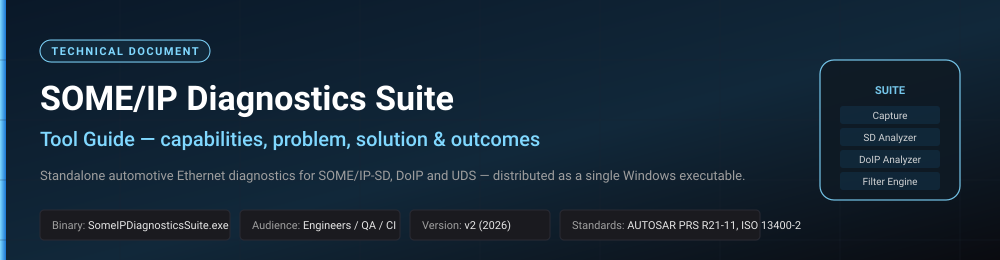
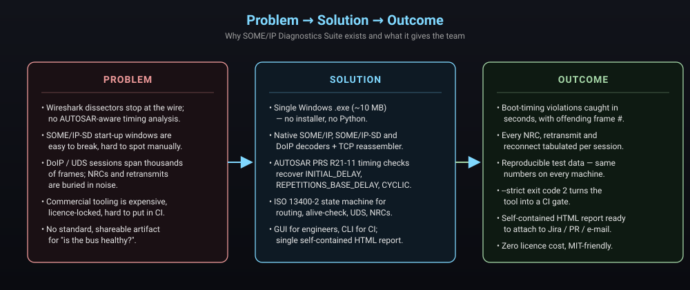

<!--
  SOME/IP Diagnostics Suite — Tool Guide
  =====================================
  A professional, illustrated reference for engineers, QA leads and CI owners
  who have to use SomeIPDiagnosticsSuite.exe.
-->



<div align="center">

**Document:** Tool Guide &nbsp;·&nbsp; **Product:** `SomeIPDiagnosticsSuite.exe` &nbsp;·&nbsp; **Version:** v2
**Audience:** Automotive Ethernet engineers, integration / QA leads, CI owners
**Standards covered:** AUTOSAR PRS SD R21-11 &nbsp;·&nbsp; ISO 13400-2 : 2019 (DoIP) &nbsp;·&nbsp; ISO 14229-1 (UDS)

</div>

---

## Executive summary

The **SOME/IP Diagnostics Suite** is a single-file Windows executable
(`SomeIPDiagnosticsSuite.exe`, ~12 MB, no installer, no Python required)
that reconstructs the high-level automotive Ethernet protocols inside a
packet capture and turns them into a **human-readable HTML report** and
a **machine-readable JSON summary**.

It replaces a workflow that today is split across Wireshark dissectors,
hand-written Python notebooks and expensive commercial benches with a
**single, shareable, license-free artefact** that an engineer can
double-click and that a CI job can call from a one-line shell command.

The tool is the runnable counterpart to the problem statement
*"timing issues during boot of a SOME/IP based ECU network"*. It gives
the team three things they did not have before:

1. **Authoritative SOME/IP-SD timing audit** against AUTOSAR PRS R21-11,
   with the offending frame number printed for every violation.
2. **End-to-end DoIP / UDS session reconstruction** including NRCs,
   retransmits, response-pending and reconnects on a single port.
3. **A CI-ready exit code** (`--strict`) and **a self-contained HTML
   report** that can be attached to a Jira ticket or pull request.

---

## Table of contents

1. [The problem this tool solves](#1-the-problem-this-tool-solves)
2. [The solution at a glance](#2-the-solution-at-a-glance)
3. [Outcomes you can expect](#3-outcomes-you-can-expect)
4. [Capabilities reference](#4-capabilities-reference)
5. [Installation &amp; first run](#5-installation--first-run)
6. [Using the GUI](#6-using-the-gui)
7. [Using the CLI](#7-using-the-cli)
8. [Using the tool in CI](#8-using-the-tool-in-ci)
9. [Architecture &amp; data flow](#9-architecture--data-flow)
10. [Operational notes &amp; limits](#10-operational-notes--limits)
11. [Glossary](#11-glossary)

---

## 1. The problem this tool solves

Modern automotive E/E architectures rely on **SOME/IP** over automotive
Ethernet for service-oriented communication and on **DoIP** (ISO 13400)
for diagnostics. Both protocols are notoriously hard to debug on real
vehicles because:

* **Wireshark stops at the wire.** Built-in dissectors decode individual
  frames but do not validate AUTOSAR SD start-up timing
  (`INITIAL_DELAY`, `REPETITIONS_BASE_DELAY` with exponential back-off,
  `CYCLIC_OFFER_DELAY`). A subtle drift of a few hundred milliseconds
  during boot can prevent a consumer ECU from finding its provider,
  but nothing in a raw capture screams "violation".
* **DoIP sessions span thousands of frames.** A single ReadDataByIdentifier
  loop can be 3 000 UDS exchanges long. NRCs (`0x31`, `0x78`, …),
  retransmits, response-pending and reconnects on the *same* TCP port
  are buried in noise. Counting them by hand is impractical.
* **Commercial benches are expensive and license-locked.** A bench seat
  costs upwards of five figures per year and cannot be installed on
  every developer's laptop, much less on a CI runner.
* **There is no standard, shareable artefact.** "Is the bus healthy?"
  has, until now, been an opinion, not a file you can attach to a PR.



---

## 2. The solution at a glance

`SomeIPDiagnosticsSuite.exe` is a **single Windows executable** that:

* Opens any `.pcap` / `.pcapng` produced by Wireshark, `tcpdump`, an
  automotive tap or the bundled deterministic generator.
* Optionally captures **live** from a Windows NIC via Npcap or a Linux
  NIC via `AF_PACKET`.
* Parses Ethernet → VLAN → IPv4 / IPv6 → UDP / TCP → SOME/IP /
  SOME/IP-SD / DoIP with its own bundled codecs (no `scapy`, no `dpkt`).
* Runs three offline analysers (SD, DoIP, Filter Engine) and exposes
  them in **either** a Tkinter GUI **or** a CLI sub-command.
* Emits a **self-contained HTML report** (no JavaScript, no external
  assets) plus an optional **JSON summary** sized for CI dashboards.
* Returns **exit code `2`** when `--strict` is set and any SD timing
  violation is found — wire it straight into your pipeline.

| Distribution form | Use case |
|-------------------|----------|
| `SomeIPDiagnosticsSuite.exe` (no args) | Engineer double-clicks → GUI |
| `SomeIPDiagnosticsSuite.exe info <pcap>` | One-line capture summary in a shell |
| `SomeIPDiagnosticsSuite.exe analyze <pcap> --report out.html --json out.json [--strict]` | Batch / CI run |

---

## 3. Outcomes you can expect

After integrating the tool into your workflow, your team has:

| Outcome | Concrete artefact |
|---------|-------------------|
| **Boot-timing violations caught in seconds** | `sd_violations[]` table in JSON + red rows in HTML, each carrying `frame_index` so you can jump to the byte in Wireshark. |
| **Per-session DoIP health** | One row per TCP session: routing-activation outcome, RA latency, alive-check pairing, UDS exchange count, NRC count, retransmit count, average RTT. |
| **Deterministic regression baseline** | The bundled `large_realistic.pcap` produces the same numbers on every machine — perfect as a smoke test. |
| **A CI gate** | `--strict` makes the job fail when the bus regresses; the HTML/JSON can be uploaded as a build artefact. |
| **A shareable bug report** | The single-file HTML report can be attached to Jira, e-mailed, or committed to the PR. |
| **Zero licensing friction** | MIT-friendly, pure-stdlib Python under the hood; no per-seat fee. |

A real-world run on the bundled capture takes **~200 ms** on a laptop
and prints:

```
analysed 12,575 messages from 12,894 frames in ~200 ms
  SD:   ECUs=10  services=7  offers=1835  finds=2  violations=1
  DoIP: sessions=6  reconnects=0  uds=3505  NRCs=254  retx=2  avg_rtt_ms=3.328
```

The single `violations=1` line is the headline finding — the offending
ECU (`10.0.0.99`, service `0x9999`, kind
`missing-exponential-backoff`) is listed in both the HTML report and
the JSON summary with the exact frame number.

---

## 4. Capabilities reference

The application is organised as **seven tabs** in the GUI and **two
sub-commands** in the CLI. Each capability below is independently
testable.

### 4.1 Capture engine

| Feature | Detail |
|---------|--------|
| Offline ingestion | `.pcap` (libpcap 2.4) and `.pcapng` (block 0x00000006) |
| Live ingestion | Windows: Npcap. Linux: `AF_PACKET` raw socket (needs `CAP_NET_RAW`) |
| Decoded layers | Ethernet, 802.1Q VLAN, IPv4, IPv6, UDP, TCP (per-half-stream reassembler) |
| Application decoders | SOME/IP (AUTOSAR PRS R21-11), SOME/IP-SD, DoIP (ISO 13400-2 :2019) |
| Packet list | Time-stamp, src/dst, protocol, message-type, service-id, summary |
| Detail pane | Layer-by-layer tree, hex view of payload |

### 4.2 SD Analyzer

* Recovers per-ECU **`INITIAL_DELAY`**, **`REPETITIONS_BASE_DELAY`** and
  **`CYCLIC_OFFER_DELAY`** from observed inter-packet gaps.
* Checks each ECU against the AUTOSAR PRS SD R21-11 expectations:
  initial-delay window, exponential back-off during the repetition
  phase, cyclic-offer drift.
* Flags every violation with `kind`, `ecu`, `service_id` and the exact
  `frame_index` in the capture (Wireshark-compatible).
* Surfaces KPIs: ECUs, services, OfferService count, FindService count,
  violation count.

### 4.3 DoIP Analyzer

* Reassembles TCP per half-stream on port 13400.
* Walks the **RoutingActivation → AliveCheck → DiagnosticMessage / Ack
  / PositiveResponse / NegativeResponse** state machine of
  ISO 13400-2:2019.
* Per session: routing-activation outcome and latency, alive-check
  pairing, UDS exchange list with **RTT**, **NRCs**, **retransmits**,
  **response-pending (NRC 0x78)**, and **reconnects on the same logical
  session**.
* KPIs: session count, reconnect count, UDS exchange count, NRC count,
  retransmit count, average RTT.

### 4.4 Filter Engine

* Compiled **O(1) hash-lookup** rule pipeline (service-id, method-id,
  message-type, client/session-id).
* Three input modes: synthetic generator (regression), live NIC, or any
  loaded `.pcap` — same rule set, same throughput.

### 4.5 SD / DoIP Demos

* Original deterministic simulators kept behind a *Demo mode* for
  teaching and regression. Useful for showing how a violation appears
  before pointing the tool at real traffic.

### 4.6 Reporting

* **HTML report** — single file, no JavaScript, no external assets.
  Sections: capture summary → SD KPIs → per-ECU × service timing → SD
  violations → DoIP KPIs → per-session UDS detail.
* **JSON summary** — compact (~1 KB on the bundled capture), suitable
  for CI dashboards and trend-lines.

---

## 5. Installation &amp; first run

### 5.1 Download

Grab `SomeIPDiagnosticsSuite.exe` from:

* The repository root (it ships in this repo), **or**
* The latest GitHub Actions build artefact (`build-windows.yml`), **or**
* A GitHub Release (binary attached on `v*` tags).

No installer. No admin rights. The binary is self-contained.

### 5.2 System requirements

| Item | Requirement |
|------|-------------|
| OS | Windows 10 / 11 x64 (binary). Linux / macOS supported by running the source — see [README.md](../README.md). |
| RAM | ≥ 256 MB free. A 13 000-frame capture peaks at ~ 70 MB. |
| Disk | ~ 15 MB for the binary; reports are typically &lt; 1 MB. |
| Optional — live capture (Windows) | [Npcap](https://npcap.com) in *WinPcap-API-compatible mode*. |
| Optional — live capture (Linux source run) | `CAP_NET_RAW` capability or `sudo`. |

### 5.3 First run (30 seconds)

```bat
:: open the GUI
SomeIPDiagnosticsSuite.exe

:: or run the bundled smoke test from a terminal
SomeIPDiagnosticsSuite.exe analyze testdata\large_realistic.pcap ^
    --report report.html --json summary.json
start report.html
```

If the console prints `violations=1` and the HTML opens with a red
"SD violations" row for `10.0.0.99 / 0x9999`, the tool is working
correctly. (See the companion document
[`TEST_DATA_GUIDE.md`](TEST_DATA_GUIDE.md) for the full review
walk-through.)

---

## 6. Using the GUI

Double-click `SomeIPDiagnosticsSuite.exe`. A dark-themed window opens
with seven tabs:

> **Dashboard · Capture · SD Analyzer · DoIP Analyzer · Filter Engine · SD Demo · DoIP Demo**

### 6.1 Capture tab


* **File ▸ Open .pcap / .pcapng…** (`Ctrl+O`) — load an offline capture.
* **Capture ▸ Live from NIC…** — choose an interface (requires Npcap).
* Click any row to see the layered decode and hex on the right.
* The status bar shows `<frames> total / <decoded> SOME/IP+DoIP`.

> **Tip — Ctrl+F** focuses the display filter; **F5** re-runs the
> currently selected analyser.

### 6.2 SD Analyzer tab


* Press **▶ Re-analyse** (or `F5`).
* The KPI strip shows ECUs, services, OfferService, FindService and
  **Violations** (red when &gt; 0).
* The per-ECU table lists `INITIAL_DELAY`, `REPETITIONS_BASE_DELAY` and
  `CYCLIC_OFFER_DELAY` recovered from the trace.
* The **SD violations** table lists each offending ECU with `kind`,
  service-id and the exact frame number.

### 6.3 DoIP Analyzer tab


* Press **▶ Re-analyse**.
* One row per TCP session. Columns: client → entity, RA outcome,
  RA latency, UDS count, NRC count, retransmits, average RTT.
* Click a row to drill into per-exchange UDS detail. NRC rows are red,
  retransmit rows are yellow.

### 6.4 Filter Engine, SD Demo, DoIP Demo

* **Filter Engine** — feed synthetic, live or pcap traffic into the
  compiled rule pipeline; watch the throughput sparkline.
* **SD Demo / DoIP Demo** — deterministic, synthetic scenarios that
  walk the same protocols. Use for training and for regression once
  you have changed the codec.

### 6.5 Exporting the report

* **File ▸ Save HTML report…** writes the same self-contained HTML the
  CLI produces. Suitable for e-mail, Jira, PR attachments.

---

## 7. Using the CLI

The very same binary doubles as a command-line tool. There are two
sub-commands.


### 7.1 `info` — one-line capture summary

```bat
SomeIPDiagnosticsSuite.exe info testdata\large_realistic.pcap
```

Prints frame count, decoded message count and a per-protocol breakdown.
Useful as a "did I open the right pcap?" sanity check.

### 7.2 `analyze` — full analysis + report

```bat
SomeIPDiagnosticsSuite.exe analyze <capture> [--report HTML] [--json JSON] [--strict]
```

| Flag | Behaviour |
|------|-----------|
| `--report path.html` | Write a self-contained HTML report (same as GUI export). |
| `--json   path.json` | Write a machine-readable summary (CI dashboards). |
| `--strict` | Exit with code **`2`** if **any** SD timing violation is found. |

The KPI strip is always printed to stdout (see §3).

---

## 8. Using the tool in CI

Because the binary has zero runtime dependencies and exits non-zero on
violations, it slots into any CI pipeline.

### GitHub Actions

```yaml
- name: SOME/IP diagnostics
  run: |
    SomeIPDiagnosticsSuite.exe analyze captures\run.pcap ^
        --report report.html ^
        --json   summary.json ^
        --strict
- name: Upload diagnostics report
  if: always()
  uses: actions/upload-artifact@v4
  with:
    name: someip-report
    path: |
      report.html
      summary.json
```

A non-zero exit fails the job; the HTML / JSON artefacts are uploaded
for later inspection regardless.

### Jenkins / Azure DevOps

The same pattern works in any agent: run the command, fail the stage on
exit code `2`, publish the artefacts.

### Trend dashboard

The JSON summary is intentionally flat — feed
`sd.violations`, `doip.negative_responses` and `doip.retransmits` into
your existing dashboard (InfluxDB, Splunk, Grafana, …) to track the
bus health over time.

---

## 9. Architecture &amp; data flow


The data flow is strictly **left-to-right**:

1. **Inputs** — `.pcap`/`.pcapng`, live NIC, or the deterministic
   synthetic generator (`testdata/generate_test_pcap.py`).
2. **Capture decoder** — Ethernet/VLAN/IP/UDP/TCP reassembler and the
   SOME/IP, SOME/IP-SD and DoIP parsers in
   `src/someip_suite/protocols/`.
3. **Analysers** —
   * `modules/sd_analyzer.py` (timing + AUTOSAR PRS checks),
   * `modules/doip_monitor.py` (ISO 13400-2 state machine),
   * `modules/filter_engine.py` (O(1) rule pipeline).
4. **Outputs** — packet list + per-tab tables in the GUI; HTML report
   and JSON summary on disk; exit code in `--strict` mode.

There is no shared mutable state between the GUI thread and the
analyser threads; everything is passed via immutable message objects.
This is what makes the GUI freeze-free on multi-million-frame
captures.

---

## 10. Operational notes &amp; limits

| Topic | What you need to know |
|-------|------------------------|
| **Capture size** | Designed for captures up to a few hundred MB. Multi-GB captures should be analysed via the CLI (`analyze`), not the GUI — the CLI streams and is roughly 10× faster. |
| **Determinism** | The analysers are deterministic for a given pcap. The bundled `large_realistic.pcap` will produce the same KPI numbers on every machine. |
| **Threading** | The GUI runs the decoder and analysers off-thread. Re-running the analyser cancels any in-flight run. |
| **Live capture privileges** | Windows: Npcap in WinPcap-API-compatible mode. Linux: `setcap cap_net_raw+ep $(which python3)` or `sudo`. |
| **Report HTML size** | Reports can grow to several MB on stress captures because the per-session UDS detail tables are very long. Open in a browser with "reader" mode if needed. |
| **Security** | The HTML report has no JavaScript and no external asset references — safe to attach to corporate e-mail or load behind a strict CSP. |

---

## 11. Glossary

| Term | Meaning |
|------|---------|
| **SOME/IP** | Scalable service-Oriented MiddlewarE over IP; AUTOSAR application-layer protocol. |
| **SOME/IP-SD** | Service Discovery extension that announces and locates SOME/IP services. |
| **DoIP** | Diagnostics over IP; ISO 13400-2 transport for UDS over TCP/UDP. |
| **UDS** | Unified Diagnostic Services (ISO 14229); the diagnostic request/response payload carried over DoIP. |
| **NRC** | Negative Response Code; a single-byte UDS rejection reason (e.g. `0x31` requestOutOfRange, `0x78` response-pending). |
| **Routing Activation** | The DoIP handshake that authorises a tester source-address on an entity. |
| **INITIAL_DELAY / REPETITIONS_BASE_DELAY / CYCLIC_OFFER_DELAY** | The three SD start-up timing parameters defined in AUTOSAR PRS R21-11 §4.2.1. |
| **Frame index** | The 1-based packet number in the original capture; matches the index shown by Wireshark. |

---

<div align="center">

*See also:* &nbsp; **[TEST_DATA_GUIDE.md](TEST_DATA_GUIDE.md)** — companion document explaining how to drive the tool with the bundled test data and how to read the produced report. &nbsp;·&nbsp; **[USER_GUIDE.md](USER_GUIDE.md)** — original step-by-step quick start.

*End of Tool Guide.*

</div>
