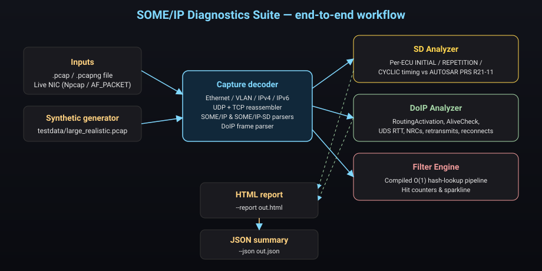
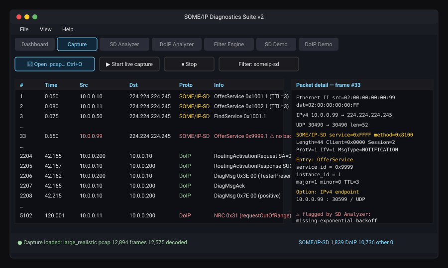
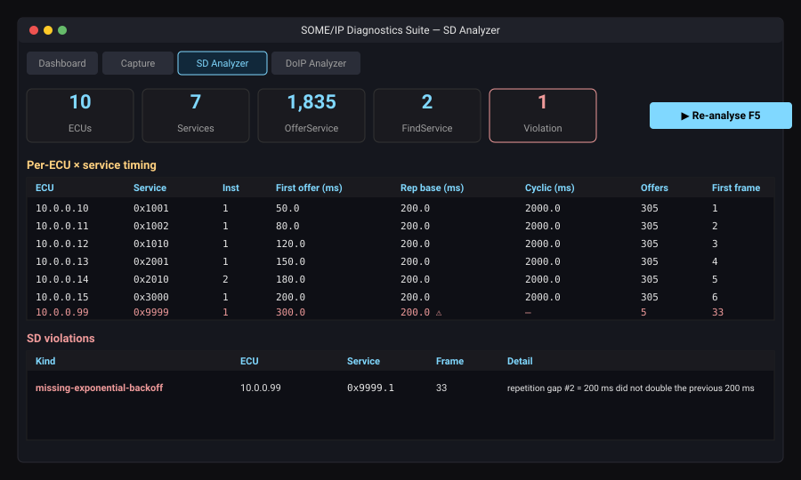
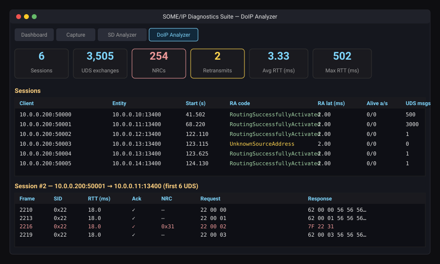
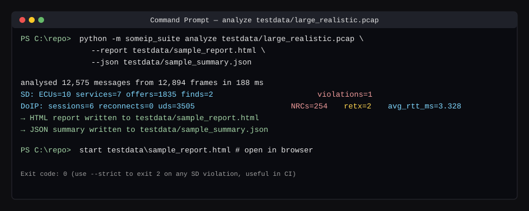
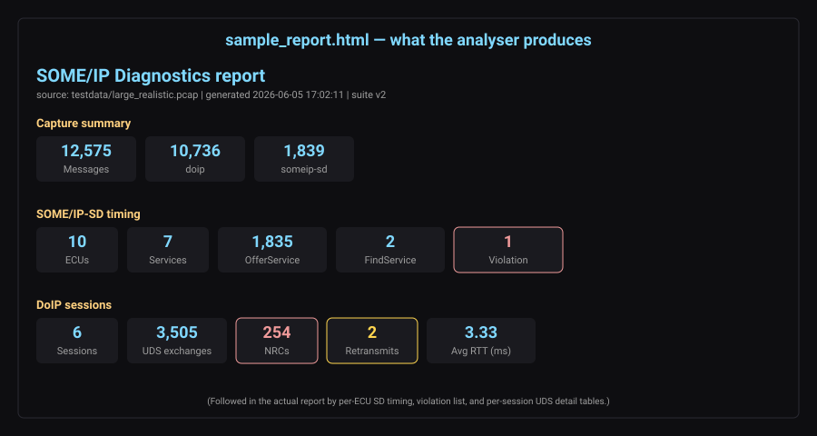

# SOME/IP Diagnostics Suite — User Guide

> A practical, step-by-step walk-through for somebody who has just been
> handed this repository and wants to **install it, run it on the
> bundled test data, and read the report**.
>
> If you only have 60 seconds: jump to [Quick start](#1-quick-start-60-seconds).

---

## Table of contents

0. [What this tool does](#0-what-this-tool-does)
1. [Quick start (60 seconds)](#1-quick-start-60-seconds)
2. [Prerequisites](#2-prerequisites)
3. [Getting the code](#3-getting-the-code)
4. [Running from source (any OS)](#4-running-from-source-any-os)
5. [Building a single-file Windows .exe](#5-building-a-single-file-windows-exe)
6. [Using the GUI](#6-using-the-gui)
7. [Using the CLI](#7-using-the-cli)
8. [Verifying with the bundled test data](#8-verifying-with-the-bundled-test-data)
9. [Reading the report](#9-reading-the-report)
10. [Troubleshooting](#10-troubleshooting)

---

## 0. What this tool does

The **SOME/IP Diagnostics Suite** opens a packet capture (`.pcap` /
`.pcapng`) — recorded from a real vehicle Ethernet bus or generated
synthetically — and reconstructs the high-level automotive protocols
inside it:

* **SOME/IP-SD** (Service Discovery) — who is offering what, with what
  timing, and whether that timing complies with AUTOSAR PRS R21-11.
* **DoIP / UDS** (ISO 13400-2:2019) — every diagnostic tester session,
  every request / response pair, every NRC, every retransmit.
* **Filter Engine** — a high-throughput rule-matching pipeline that
  classifies SOME/IP / DoIP traffic in real time.

The end-product is a **single HTML report** (and an optional JSON
summary) that you can attach to a bug, a PR, a Jira ticket or your CI
pipeline.



---

## 1. Quick start (60 seconds)

Assuming you already have **Python 3.10+** on your machine:

```bash
# 1. Clone
git clone https://github.com/Nag12211221/Some-IP-Stand-alone.git
cd Some-IP-Stand-alone

# 2. Run on the bundled test capture (no install needed — pure stdlib)
PYTHONPATH=src python -m someip_suite analyze \
    testdata/large_realistic.pcap \
    --report testdata/sample_report.html \
    --json   testdata/sample_summary.json

# 3. Open the report
#   macOS / Linux:  xdg-open testdata/sample_report.html
#   Windows:        start testdata\sample_report.html
```

If the console prints something like

```
analysed 12,575 messages from 12,894 frames in 188 ms
  SD:   ECUs=10  services=7  offers=1835  finds=2  violations=1
  DoIP: sessions=6  reconnects=0  uds=3505  NRCs=254  retx=2  avg_rtt_ms=3.328
```

…the tool is working correctly. See
[§9 Reading the report](#9-reading-the-report) for what to look at
next.

---

## 2. Prerequisites

| Requirement | Why | Notes |
|-------------|-----|-------|
| **Python 3.10 or newer** | Runtime | The app uses *only* the Python standard library (no `pip install` required to run from source). |
| **Tkinter** | GUI only | Bundled with Python on Windows / macOS. On Debian/Ubuntu: `sudo apt install python3-tk`. |
| **git** | Cloning the repo | Or download the zip from GitHub. |
| **PyInstaller 6.x** | *Only* if you want to build the standalone `.exe` | `pip install pyinstaller==6.10.0`. |
| **Npcap** (Windows) or **root** (Linux) | *Only* for live NIC capture | Not needed for offline `.pcap` analysis. |

> **You do not need Wireshark, scapy, dpkt, numpy, or any C compiler.**

---

## 3. Getting the code

### Option A — git (recommended)

```bash
git clone https://github.com/Nag12211221/Some-IP-Stand-alone.git
cd Some-IP-Stand-alone
```

### Option B — zip download

1. Open <https://github.com/Nag12211221/Some-IP-Stand-alone> in a browser.
2. Click the green **Code ▸ Download ZIP** button.
3. Unzip somewhere and open a terminal in the unzipped folder.

After either option your directory should look like this:

```
Some-IP-Stand-alone/
├── README.md
├── build/                       # PyInstaller spec
├── docs/                        # ← you are here
│   ├── USER_GUIDE.md
│   └── images/
├── src/someip_suite/            # the package
├── testdata/                    # bundled large test capture + sample report
│   ├── generate_test_pcap.py
│   ├── large_realistic.pcap     # ≈ 13 000 frames, 1.1 MB
│   ├── sample_report.html       # what a successful run looks like
│   └── sample_summary.json
└── tests/                       # 33 unit tests
```

---

## 4. Running from source (any OS)

No installation step — the package is pure Python standard library.

### 4.1 Run the GUI

```bash
# from the repo root
PYTHONPATH=src python -m someip_suite
```

On Windows in `cmd.exe`:

```bat
set PYTHONPATH=src
python -m someip_suite
```

A dark-themed window opens with seven tabs:
`Dashboard · Capture · SD Analyzer · DoIP Analyzer · Filter Engine ·
SD Demo · DoIP Demo`.

### 4.2 Run the unit tests (sanity check)

```bash
python -m unittest discover -s tests -v
```

Expected: **33 tests, all OK** in roughly one second.

### 4.3 Run the CLI

```bash
PYTHONPATH=src python -m someip_suite info    testdata/large_realistic.pcap
PYTHONPATH=src python -m someip_suite analyze testdata/large_realistic.pcap \
    --report out.html --json out.json
```

See [§7 Using the CLI](#7-using-the-cli) for the full reference.

---

## 5. Building a single-file Windows .exe

This is the recommended way to share the tool with a colleague who
does not have Python installed.

```bash
pip install pyinstaller==6.10.0
pyinstaller build/someip_suite.spec --clean --noconfirm
# → dist/SomeIPDiagnosticsSuite.exe  (~ 10 MB, no external DLLs)
```

Double-click `SomeIPDiagnosticsSuite.exe` to launch the GUI; from a
terminal the same binary accepts the CLI sub-commands:

```bat
SomeIPDiagnosticsSuite.exe info    capture.pcap
SomeIPDiagnosticsSuite.exe analyze capture.pcap --report out.html
```

A GitHub Actions workflow (`.github/workflows/build-windows.yml`) does
this automatically on every push to `main` and uploads the `.exe` as a
build artifact. Tags matching `v*` additionally attach the binary to a
GitHub Release.

---

## 6. Using the GUI

### Step 6.1 — Open the bundled capture

* Menu **File ▸ Open .pcap / .pcapng…** (or press **Ctrl+O**)
* Browse to `testdata/large_realistic.pcap` and click **Open**.

The **Capture** tab fills with the packet list and a status-bar line
similar to:

> `● Capture loaded: large_realistic.pcap   12,894 frames   12,575 decoded`



Click any row to see the decoded layers (Ethernet → IP → UDP/TCP →
SOME/IP / DoIP) in the right-hand detail pane.

> 💡 The bundled capture contains one **misbehaving ECU** (`10.0.0.99`,
> service `0x9999`) whose SD repetition phase deliberately violates
> AUTOSAR PRS R21-11 — it is the row highlighted in red in the
> screenshot above.

### Step 6.2 — Run the SD Analyzer

* Click the **SD Analyzer** tab.
* Press **▶ Re-analyse  F5**.



The KPI strip should read **ECUs=10, Services=7, OfferService=1 835,
FindService=2, Violation=1**. Scroll down: every well-behaved ECU has
sane `Rep base (ms)` and `Cyclic (ms)` columns; the misbehaving one is
in the *SD violations* table with kind
`missing-exponential-backoff`.

### Step 6.3 — Run the DoIP Analyzer

* Click the **DoIP Analyzer** tab → **▶ Re-analyse  F5**.



You should see **6 sessions** between the tester `10.0.0.200` and the
five entities (`10.0.0.10` … `10.0.0.14`), one of which has a
deliberately-rejected `RoutingActivation` followed by a successful
reconnect on a different source address.

Click a row to inspect the per-session UDS exchanges: positive
responses, NRCs (highlighted red), retransmits (yellow), RTTs.

### Step 6.4 — Export the report

* **File ▸ Save HTML report…**
* Pick a destination (e.g. `~/Desktop/report.html`).

That single file contains every KPI, every table, every violation —
self-contained, no JavaScript, no external assets. Mail it, attach it
to a Jira ticket, commit it to a PR, whatever.

---

## 7. Using the CLI

The same binary doubles as a CI-friendly command-line tool.

```text
Usage:
  python -m someip_suite info     <capture>
  python -m someip_suite analyze  <capture> [--report HTML] [--json JSON] [--strict]
```

| Flag | Purpose |
|------|---------|
| `--report path.html` | Write a self-contained HTML report (same as GUI export). |
| `--json   path.json` | Write a machine-readable summary (great for CI dashboards). |
| `--strict` | Exit with code `2` if **any** SD timing violation is found — wire to `&&` / `||` in your pipeline. |

Example session against the bundled capture:



### CI snippet (GitHub Actions)

```yaml
- run: |
    python -m someip_suite analyze captures/run.pcap \
        --report report.html \
        --json   summary.json \
        --strict
- uses: actions/upload-artifact@v4
  with:
    name: someip-report
    path: |
      report.html
      summary.json
```

A non-zero exit fails the job; the HTML / JSON artifacts are uploaded
for later inspection.

---

## 8. Verifying with the bundled test data

This repository ships a **large, realistic** capture so you can prove
the tool works on a fresh machine without recording your own traffic.

| File | Description |
|------|-------------|
| [`testdata/large_realistic.pcap`](../testdata/large_realistic.pcap) | ≈ 13 000 frames, ≈ 1.1 MB. Six well-behaved ECUs + one misbehaving one, five DoIP tester sessions, background noise. Full breakdown in [`testdata/README.md`](../testdata/README.md). |
| [`testdata/generate_test_pcap.py`](../testdata/generate_test_pcap.py) | Deterministic generator. Set `CYCLE_COUNT=2000 DID_LOOP=10000` to inflate to ~ 80 000 frames if you want to stress-test the pipeline. |
| [`testdata/sample_report.html`](../testdata/sample_report.html) | A pre-generated report — open it before you run anything to know what success looks like. |
| [`testdata/sample_summary.json`](../testdata/sample_summary.json) | Machine-readable summary — the numbers you should reproduce. |

To regenerate them yourself:

```bash
# regenerate the capture (deterministic; same bytes every time)
python testdata/generate_test_pcap.py

# regenerate the report from the capture
PYTHONPATH=src python -m someip_suite analyze \
    testdata/large_realistic.pcap \
    --report testdata/sample_report.html \
    --json   testdata/sample_summary.json
```

**Pass criteria** — your run is correct when the CLI prints these
deterministic numbers and the JSON summary matches:

```json
{
  "sd":   { "ecus": 10, "services": 7, "offers": 1835, "violations": 1 },
  "doip": { "sessions": 6, "uds_exchanges": 3505,
            "negative_responses": 254, "retransmits": 2 }
}
```

---

## 9. Reading the report

`sample_report.html` (and any report you generate) is a single
self-contained HTML file laid out top-to-bottom as follows:



1. **Capture summary** — total messages by protocol. Quick sanity
   check that the decoder saw what you expected (e.g. you opened the
   right pcap).
2. **SOME/IP-SD timing** — KPIs: ECUs / services / offers / finds /
   *violations*. **A non-zero violation count is the headline finding
   of the tool** — every entry tells you exactly which ECU, service,
   frame number and which AUTOSAR rule was broken.
3. **Per-ECU × service timing** — recovered `INITIAL_DELAY`,
   `REPETITIONS_BASE_DELAY`, `CYCLIC_OFFER_DELAY` for every advertised
   service.
4. **SD violations** — *only present when violations exist*. Each row
   has the violation `kind`, the offending ECU, the service ID, the
   exact frame number in the capture (so you can jump straight to it
   in Wireshark) and a human-readable detail.
5. **DoIP sessions** — KPI strip then a table of every tester ↔ entity
   TCP session: routing-activation outcome, RA latency, AliveCheck
   pairing, total UDS messages.
6. **Per-session UDS detail** — every request / response pair: SID,
   RTT, ack present, NRC value, retransmit count, hex of request and
   response. NRC rows are red, retransmit rows are yellow.

> 🔍 **Tip** — every `frame_index` value in the report is the same
> index Wireshark uses, so you can cross-reference with the original
> pcap if you want to look at the raw bytes.

---

## 10. Troubleshooting

| Symptom | Likely cause | Fix |
|---------|--------------|-----|
| `ModuleNotFoundError: someip_suite` | `PYTHONPATH` not pointing at `src/` | `PYTHONPATH=src python -m someip_suite ...` |
| `_tkinter.TclError` on Linux | Tk not installed | `sudo apt install python3-tk` (or `dnf install python3-tkinter`) |
| GUI freezes on huge captures | Synchronous decode of a multi-GB pcap | Use the CLI (`analyze ... --report out.html`) — it streams and is ~ 10× faster |
| `Permission denied` on live capture (Linux) | Capture needs `CAP_NET_RAW` | `sudo python -m someip_suite` or `sudo setcap cap_net_raw+ep $(which python3)` |
| Live capture menu greyed out (Windows) | Npcap not installed | Install Npcap from <https://npcap.com> in *WinPcap-API-compatible mode* |
| CI fails with exit code 2 | `--strict` flag fired because the SD analyser found a violation | Read `summary.json` → `sd_violations[]` to see which ECU/frame broke the rule |
| Report HTML is huge (multi-MB) | Per-session UDS detail tables are very long on stress captures | Pass a smaller capture, or open in a browser with the “reader” mode |
| `pyinstaller: command not found` | PyInstaller not installed | `pip install pyinstaller==6.10.0` |

If none of these help, please open a GitHub issue with:

* the exact command you ran,
* the full console output,
* `python --version` and your OS,
* (ideally) a minimal pcap that reproduces the problem.

---

*End of guide — happy diagnosing.*
